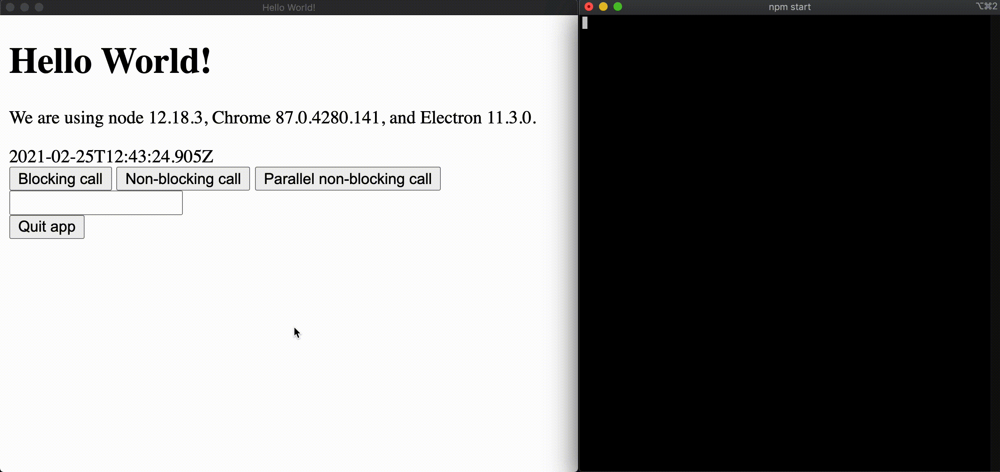
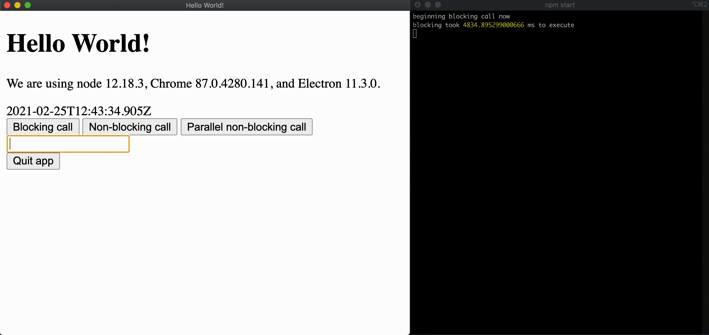
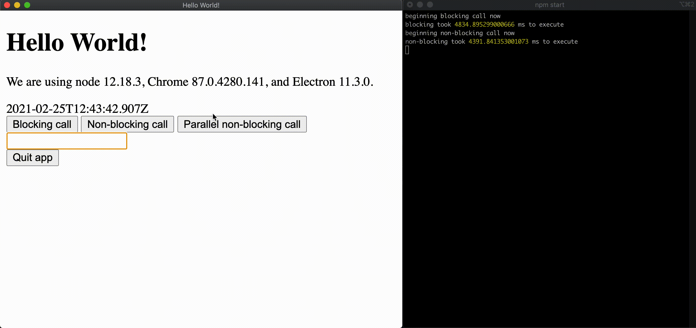
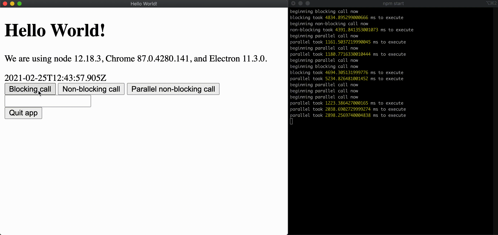

# event-loop

A minimal example of how blocking calls in Electron degrade the user experience.

### Getting started

```shell
$ git clone https://github.com/acdibble/event-loop.git
$ cd event-loop
$ npm i
$ npm start
```

There are three buttons to push:

## Blocking call (bad)

This initiates a blocking cryptographic call. The user interface freezes
completely while this call executes, i.e. the event loops of both the renderer
and main process are blocked. Pushing any other button on the UI has no
immediate effect. Moreover, there is no ability to parallelize these calls and
they must be executed serially.

In the following GIF, we see how the blocking call prevents the input from
updating until the execution of the blocking code has finished:


## Non-blocking call (good)

This initiates the same exact logic but asynchronously. Because the calls are
asynchronous, we are able to run multiple concurrently, which is demonstrable
by pushing the button in quick succession. This call lasts as long as its
blocking counterpart.

In the following GIF, we see how the non-blocking call allows the input to
register the input events while the non-blocking call executes:


## Parallel call (best)

While JavaScript (and therefore Node.js) is single-threaded, utilizing
asynchronous calls allows for parallelization of calls that execute outside of
the JavaScript event loop. This call runs much faster than the naive
asynchronous function and is therefore preferred.

In the following GIF, we see how `Promise.all` can speed up the execution of
asynchronous code. However, if a blocking call executes at the same time as the
asynchronous code, the asynchronous code will not finish before the blocking
call:


Events will continue to be registered but they cannot be handled until the loop
is unblocked as we see demonstrated by clicking the blocking call button several
times followed by the parallel button once:

